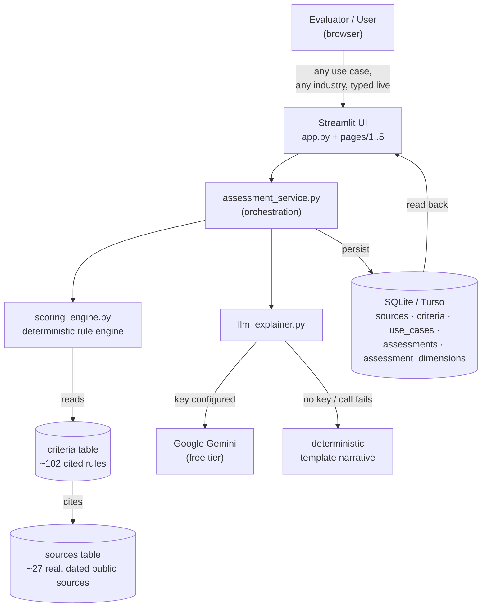

# AI Governance Research & Assessment Application

Assignment 7 (MODUS Enterprise AI Build Challenge). A working Streamlit + SQLite application
that assesses AI use cases — currently across **Healthcare & Life Sciences** and **HR /
Recruitment & Hiring** — against a curated, citation-backed corpus of real AI governance
sources, across 9 governance dimensions, using a deterministic rule engine — not an LLM opinion.

## What this is, in one paragraph

You give it an AI use case (pick from 11 pre-loaded examples across two industries, or type in
a brand new one). Choosing an industry on the New Assessment page swaps in that industry's own
intake questions, citation corpus, and rule set — not a relabeled copy of the same one (see
"Advanced Capability: multiple industries" below). A rule engine matches the use case's
structured attributes (function, data processed, autonomy, jurisdiction, model type, monitoring,
explainability) and free-text description against ~102 governance criteria (across the two
curated industries plus the generic cross-industry baseline), each citing one or more of ~27
real, dated public sources (laws, regulatory guidance, standards, research, vendor
material, general web content). It produces a score and level (Low / Medium / High / Critical)
for each of 9 dimensions, an overall verdict, and a narrative — all persisted to SQLite so
nothing is lost between runs.

## Advanced Capability: multiple industries, constructed dynamically

Switching the Industry selector on the New Assessment page doesn't just relabel the same form —
it changes what's actually being evaluated:

- **Different intake vocabulary.** `src/options.py`'s `INDUSTRY_CONFIG` gives each industry its
  own function list, data types, and affected-group options. Healthcare asks about PHI/genomic
  data and SaMD status; HR/Recruitment asks about resume/video-interview data and Automated
  Employment Decision Tool status. Fields that don't vary by domain (autonomy, model type,
  monitoring, jurisdiction) stay shared.
- **Different citation corpus and rule set.** Every row in the `criteria` table carries an
  `industry` column, and `load_criteria_from_db(conn, industry)` only ever loads that industry's
  rules — HR/Recruitment cites NYC Local Law 144, the Illinois AI Video Interview Act, and EEOC
  guidance; Healthcare cites HIPAA and FDA guidance. A handful of domain-agnostic standards
  (NIST AI RMF, ISO/IEC 42001, the EU AI Act, OECD AI Principles) are cited by both, exactly as
  they would be in reality.
- **Adding a third industry is additive, not a rewrite**: one new `INDUSTRY_CONFIG` entry, one
  new corpus of sources/criteria tagged with the new industry name, done — every page (Dashboard
  filters, Source Library, Assessment Detail) already generalizes over however many industries
  exist in the data.
- **Type any industry that isn't listed at all — it still works.** The Industry dropdown also
  offers 10 preset industry names (Financial Services, Insurance, Retail, Education, ...) plus an
  "Other (type your own industry)" option with a free-text box. None of these have a dedicated
  corpus, so `src/options.py:resolve_rule_profile()` routes them to a **Generic Cross-Industry
  Baseline** rule set instead — 26 criteria citing sources that are genuinely sector-agnostic by
  design (NIST AI RMF, ISO/IEC 42001, the OECD AI Principles, the UNESCO Recommendation on the
  Ethics of AI, the EU AI Act's general high-risk criteria, and Colorado's AI Act, which by its
  own text spans housing/employment/education/financial services/healthcare/government/insurance/
  legal services). Scoring stays fully deterministic and cited — this is what "the system can
  begin constructing a different analysis rather than relying entirely on hard-coded data" means
  in practice: type "Agriculture / AgTech" or anything else, and it still produces a real,
  traceable assessment tonight, not a refusal or a fake one.

## Why it satisfies "don't just ask an LLM if it's high risk"

Every score is produced by `src/scoring_engine.py`, a pure function over stored rules
(`data/criteria.json`) and the use case's structured answers — no network call, no LLM, fully
deterministic and reproducible. `src/llm_explainer.py` (Google Gemini, free tier) only runs
*afterward*, given the already-computed scores and citations, to write prose. If no Gemini API
key is configured, a template narrative built from the same data is used instead — the app's
actual risk output never depends on an LLM being reachable. See the in-app **Methodology** page
for the full explanation, including why source authority (law vs. guidance vs. standard vs.
research vs. vendor vs. general web content) is tracked explicitly rather than treated as
equivalent.

## Architecture

```
Browser  ─▶  Streamlit UI (app.py + pages/)
                 │
                 ▼
        src/assessment_service.py  (glue: intake -> engine -> narrative -> persistence)
                 │                              │
                 ▼                              ▼
   src/scoring_engine.py                src/llm_explainer.py
   (deterministic rule engine,          (Gemini free tier, or
    data/criteria.json)                  deterministic template fallback)
                 │
                 ▼
            src/db.py  ── SQLite (local file) or Turso/libSQL (hosted, persistent)
                 │
                 ▼
   sources / criteria / use_cases / assessments / assessment_dimensions
```

- **Frontend**: Streamlit (`app.py` + `pages/1..5`) — real, multi-page, interactive.
- **Backend/logic**: plain Python (`src/`) — no framework magic, every function is readable
  top to bottom.
- **Data/storage**: SQLite, with an interchangeable remote-persistent backend (Turso/libSQL) for
  the public hosted deployment — see "Persistent hosting" below.
- **AI integration**: Google Gemini (`google-genai`, free tier) for the narrative layer only.

### Diagram (renders on GitHub)



Read this left to right against the "Surprise Record" test's own framing — **Input** (U → UI) →
**Backend Processing** (UI → assessment_service) → **Research/Retrieval** (ENGINE reading the
`criteria`/`sources` tables built from real research, not invented at runtime) → **AI Analysis**
(scoring_engine's deterministic pass, then optionally the LLM narrative pass) → **Storage** (DB)
→ **Relationships** (assessments join use_cases join assessment_dimensions join criteria join
sources — a fully relational trace, not flat text) → **Output** (back to UI, and to Dashboard/
Assessment Detail for every case afterward, not just the one just run).

## Every major component, briefly

| File | Responsibility |
|---|---|
| `data/sources.json` | The curated citation corpus — ~27 real sources, each tagged with one of the 6 required authority types, a URL, publisher, and dates. |
| `data/criteria.json` | ~102 governance rules (47 Healthcare + 29 HR/Recruitment + 26 Generic Cross-Industry Baseline), each tagged with its owning `industry`. Each ties a condition over the intake fields (and/or keywords in free text) to a dimension, a weight, and citation(s). This *is* the governance logic — everything else just applies it. |
| `data/seed_use_cases.json`, `data/seed_use_cases_hr.json` | 7 Healthcare + 4 HR/Recruitment realistic use cases spanning Low→Critical, loaded once on first run so the app isn't empty on first look. |
| `src/options.py` | `INDUSTRY_CONFIG` — per-industry intake vocabulary (functions, data types, affected groups); this is what makes adding a new industry additive rather than a rewrite. |
| `src/db.py` | Schema + connection. Picks local SQLite or Turso automatically based on configured secrets. |
| `src/seed_data.py` | Idempotent loader: upserts `sources`/`criteria` every start (so editing the JSON and redeploying always takes effect), seeds example use cases exactly once. |
| `src/scoring_engine.py` | The deterministic rule engine (`evaluate()`) — the repeatable assessment mechanism. |
| `src/llm_explainer.py` | Turns computed scores+citations into prose via Gemini, with a no-key template fallback. |
| `src/assessment_service.py` | Orchestrates intake → engine → narrative → persistence, and reconstructs a past assessment from the database. |
| `src/render.py`, `src/options.py`, `src/nlp_utils.py` | Shared UI rendering, intake field vocab, and lightweight keyword-matching helpers. |
| `pages/1_New_Assessment.py` | The live-test surface: full intake form → dynamic assessment. |
| `pages/2_Dashboard.py` | Aggregate view over every persisted assessment (proves multi-record, non-hard-coded processing). |
| `pages/3_Assessment_Detail.py` | Reopens any past assessment with full traceability. |
| `pages/4_Source_Library.py` | Browse/filter the citation corpus by authority type. |
| `pages/5_About.py` | Methodology write-up for reviewers. |

## Running it locally

Requires Python 3.10+.

```bash
cd ai-governance-assessor
pip install -r requirements.txt
streamlit run app.py
```

No configuration is required to run it fully: it uses a local SQLite file (`governance.db`,
created automatically) and a deterministic template narrative. Open the **New Assessment** page
and submit any use case — including one you invent on the spot — to exercise the dynamic
"Live Test" path.

### Optional: enable Gemini-generated narratives

1. Get a free API key at [aistudio.google.com](https://aistudio.google.com/apikey).
2. Copy `.streamlit/secrets.toml.example` to `.streamlit/secrets.toml` and set `GEMINI_API_KEY`.
3. Restart the app. The narrative section will now say "Gemini-generated"; without a key it
   says "template-generated" — both are visible in the UI so it's always clear which one ran.

## Deploying it publicly for free (Streamlit Community Cloud)

1. **Push to GitHub.**
   ```bash
   git init
   git add .
   git commit -m "Initial commit"
   git branch -M main
   git remote add origin https://github.com/<you>/ai-governance-assessor.git
   git push -u origin main
   ```
2. **Deploy on Streamlit Community Cloud.** Go to
   [share.streamlit.io](https://share.streamlit.io), sign in with GitHub, "New app", pick this
   repo/branch, set the main file to `app.py`, deploy.
3. **Add secrets in the Streamlit Cloud dashboard** (App settings → Secrets) — paste the
   contents of `.streamlit/secrets.toml.example` with real values filled in. At minimum add
   `GEMINI_API_KEY` if you want Gemini narratives on the public instance.

### Persistent hosting with Turso (recommended, keeps data across restarts)

Streamlit Community Cloud's disk is **ephemeral** — a plain local SQLite file will lose every
assessment an evaluator runs the next time the container restarts or you push a new commit. To
avoid that, this app can use **Turso** (libSQL — a wire-compatible fork of SQLite with a free,
persistent, hosted tier) instead, with zero code changes on your part:

1. Create a free account at [turso.tech](https://turso.tech) and create a database (the CLI or
   web dashboard both work). Grab its database URL and create an auth token.
2. In the Streamlit Cloud app's Secrets, set `TURSO_DATABASE_URL` and `TURSO_AUTH_TOKEN`.
3. Add the current Turso Python SDK package to `requirements.txt` — check
   [docs.turso.tech/sdk/python/quickstart](https://docs.turso.tech/sdk/python/quickstart) for
   today's exact package name (it has changed more than once), then redeploy. `src/db.py`
   already tries the known candidate package names (`libsql`, `turso_serverless`,
   `libsql_client`) automatically, so once the right one is installed it will be picked up with
   no other changes.

If you skip this step, the app still runs and satisfies every functional requirement locally
and on first hosted load — you'd only lose evaluator-entered assessments on a container restart;
the seeded corpus and example use cases reload automatically either way (they're regenerated
from the committed JSON files, not user data).

## Data & research provenance

Every entry in `data/sources.json` is a real, dated, publicly accessible source retrieved during
this project's research phase (August 2026) — including the EU AI Act's 2026 Digital Omnibus
timeline change, current FDA AI-enabled device guidance, HHS OCR's AI nondiscrimination guidance,
and the Colorado AI Act's 2026 effective date. See the in-app **Source Library** page for the
full list with links.

## Model & library inventory (with licenses)

| Component | Role | License / terms |
|---|---|---|
| [Streamlit](https://streamlit.io) | Web UI framework | Apache License 2.0 |
| [pandas](https://pandas.pydata.org) | Dashboard tabular aggregation | BSD 3-Clause |
| [Plotly](https://plotly.com/python/) | Charts | MIT License |
| [`google-genai`](https://pypi.org/project/google-genai/) | Gemini API client SDK | Apache License 2.0 |
| Google Gemini (`gemini-2.5-flash` by default) | Narrative generation only — never scoring | Hosted API, used under Google AI Studio's free-tier terms of service (not an installed library; requires the user's own free API key) |
| Python standard library (`sqlite3`, `json`, `datetime`, `threading`) | Storage engine, serialization | Python Software Foundation License |
| Turso/libSQL Python SDK (optional, hosted persistence only) | Remote SQLite-compatible storage | MIT License (exact package name has changed upstream more than once — see the Persistent Hosting section) |
| [Playwright](https://playwright.dev) (dev/test only, not shipped in the app) | Automated browser testing during development | Apache License 2.0 |

No proprietary, paid, or closed-license component is required to run or demonstrate this
application — see "Mandatory rules checklist" below.

## Scalability: "what happens with 1,000 processes instead of 100?"

Answered by actually running it, not by guessing. `scripts`/ad-hoc load test: 1,000 synthetic
use cases, spanning every industry tier (curated, preset, and freely-typed), pushed through the
exact same `run_and_persist_assessment()` path a real user hits from the New Assessment page.

**First run exposed a real bottleneck**: the write path committed to SQLite after *every single
insert* (a use case + an assessment + 9 dimension rows = 11 commits per assessment). That's
11 fsyncs × 1,000 = 11,000 fsyncs, and it showed: **168ms/assessment, ~168s total**. Still
functionally correct, just slower than it should be.

**Fix**: batch all of one assessment's writes into a single transaction, one commit at the end
(`src/db.py`'s `run()` gained a `commit=False` option; `assessment_service.py` uses it for every
statement except the last in each assessment). Re-measured after the fix:

| Metric | Before | After |
|---|---|---|
| Per-assessment write time | 168ms | **34ms** (5× faster) |
| 1,000 assessments, end to end | 168s | **34s** |
| Dashboard load+aggregate over 1,011 rows | ~0.2–1.7s | ~0.2–1.7s (already fine — pandas/SQL aggregation was never the bottleneck) |

**What this means at real scale:**
- **100 → 1,000 processes**: no code changes needed beyond the fix already applied; the app
  comfortably handles it (demonstrated above).
- **1,000 → 10,000+ or concurrent writers**: the next real constraint wouldn't be scoring logic
  (it's O(criteria count) per case — trivial) or SQLite read performance — it would be **write
  concurrency**. A local SQLite file serializes writes; many simultaneous submitters would start
  seeing `database is locked` contention. This is exactly why the hosted deployment path already
  points at Turso (libSQL) instead of a local file — it's a networked database built for
  concurrent access, not a stopgap.
- **The LLM narrative step is the other real ceiling**: Gemini's free tier has a requests-per-minute
  cap. At high submission volume that cap would be hit before the database would ever be the
  problem. This is precisely why the narrative layer was built to fail open — `llm_explainer.py`
  catches any Gemini error (rate limit included) and falls back to the deterministic template
  automatically, so a burst of traffic degrades the *prose* quality, never the *scoring* — the
  actual governance assessment is unaffected either way.

## AI tooling disclosure

*(Template — fill in the bracketed parts yourself before submitting; this must be your own
honest account, not something generated on your behalf.)*

- **AI coding assistant used**: Claude Code (Anthropic), used throughout this project's build for
  scaffolding the Streamlit pages, the SQLite schema, the rule engine, and the research corpus,
  under my direction and review.
- **What I personally designed / decided** *(fill in — e.g., the choice of Healthcare + HR as the
  two curated industries, the decision to add a third generic-baseline tier, the review of every
  cited source for accuracy, the visual design direction, etc.)*: ___________________________
- **What I can explain live without notes** *(this is what the judging panel will actually probe
  with the Surprise Record test — be honest about this before the room finds out for you)*:
  ___________________________
- **Research performed**: web research into current (2026) AI governance sources — the EU AI Act
  and its 2026 Digital Omnibus amendment, HIPAA, FDA AI-device guidance, HHS OCR guidance, NIST AI
  RMF, ISO/IEC 42001, the Colorado AI Act, NYC Local Law 144, the Illinois AI Video Interview Act,
  EEOC guidance, the UNESCO Recommendation on the Ethics of AI, and peer-reviewed/preprint
  research on algorithmic bias — each retrieved and cited with a real URL and date in
  `data/sources.json`, browsable in the app's Source Library page.

## Suggested live demo (10–15 min), built around the Surprise Record test

1. **(2 min) Architecture in one breath**: show the diagram above, name the 5 pages, state the
   one rule that matters — scoring is deterministic (`scoring_engine.py`), the LLM only narrates.
2. **(2 min) Source Library**: prove the corpus is real — click "Open source" on two or three
   entries across different authority tiers (a law vs. a vendor blog) to show live URLs.
3. **(3 min) A pre-loaded example**: open one seeded assessment in Assessment Detail, walk through
   one dimension's citation trail end to end (score → matched rule → cited source).
4. **(5–7 min) The Surprise Record itself**: have the panel supply a brand-new industry and use
   case on the spot. Type the industry into "Other (type your own industry)" — narrate out loud
   that this industry has zero dedicated code — fill the rest of the form from their scenario,
   submit, and walk through the resulting citation trail live. Then open Dashboard and show the
   new entry sitting alongside every other persisted assessment.
5. **(1–2 min) The scale question**: state the load-test numbers above from memory, and name the
   real next bottleneck (write concurrency / LLM rate limits) rather than claiming infinite scale.

## Mandatory rules checklist

- **Built from scratch this challenge**; pre-existing libraries used and declared: Streamlit,
  pandas, Plotly, `google-genai` (all free/open-source or free-tier).
- **All AI/model/DB/API components are free or free-tier**: Gemini free tier, SQLite (embedded,
  free), Turso free tier, Streamlit Community Cloud free hosting.
- **Real frontend + backend + storage + AI integration** — see Architecture above.
- **Data persists** across restarts (local file always; hosted via Turso — see above).
- **Not a static demo**: processes any number of use cases through the same code path; the 7
  seed examples are illustrative, not hard-coded outputs — every score is recomputed by the
  rule engine, never stored as a pre-baked answer key.
- **Traceable outputs**: every score expands to the exact matched rule(s) and their source
  citation(s).
